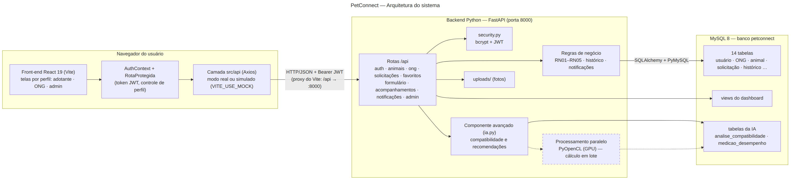

# PetConnect: Plataforma de Adoção de Animais

Sistema que conecta animais resgatados por ONGs a adotantes compatíveis. Projeto integrado das disciplinas **Fábrica de Software** e **Tópicos Avançados** (2026.2).

- O adotante preenche um formulário de avaliação, e o sistema calcula a **compatibilidade** com cada animal.
- A ONG recebe as solicitações já com esse índice e decide.
- O administrador aprova ONGs e acompanha os indicadores.

> **Equipe:** Grupo **[Nº]**: [Nome 1] · [Nome 2] · [Nome 3] · [Nome 4] · [Nome 5]

## Arquitetura



| Camada | Tecnologia | Pasta |
|---|---|---|
| Interface | React 19 + Vite + React Router + Axios | `src/`, `public/` |
| API / regras de negócio | Python + FastAPI + SQLAlchemy + JWT | `backend/` |
| Banco de dados | MySQL 8 | `database/` |
| Componente avançado | Modelo de compatibilidade + processamento em lote com OpenCL | `backend/app/routes/ia.py` *(em evolução)* |

## Estrutura do repositório
```
backend/      API em FastAPI (ver backend/README.md)
database/     scripts SQL, dados de exemplo e diagramas MER/relacional (ver database/README.md)
docs/         contrato da API, diagramas, documentação das Sprints e do front
public/       arquivos estáticos do front (inclui fotos de exemplo dos animais)
src/          código do front-end React
```

## Como executar localmente

São três partes, nesta ordem. Na primeira vez, siga os READMEs de cada uma.

1. **Banco:** rode `database/01_schema.sql`, `02_views.sql` e `03_seed.sql` no MySQL Workbench. Detalhes em [database/README.md](database/README.md).
2. **Backend:** na pasta `backend`, configure o `.env` e rode `uvicorn app.main:app --reload --port 8000`. Detalhes em [backend/README.md](backend/README.md).
3. **Front-end:** na raiz do projeto:
   ```bash
   npm install
   copy .env.example .env      # e deixe VITE_USE_MOCK=false para usar o backend
   npm run dev
   ```
   Abra http://localhost:5173. Detalhes em [docs/FRONTEND.md](docs/FRONTEND.md).

> Com `VITE_USE_MOCK=true`, o front funciona sozinho, com dados simulados no navegador (útil para desenvolver as telas sem o backend).

### Contas de teste (senha `123456`)
| Perfil | E-mail |
|---|---|
| Adotante | ana@email.com |
| ONG | ong@patinhas.org |
| Administrador | admin@adotapet.com |

## Documentação
- [Documentação das Sprints](docs/sprints/) (arquitetura, diagramas, testes, evidências)
- [Contrato da API](docs/CONTRATO_API.md): todas as rotas e o formato do JSON
- [Banco de dados](database/README.md): tabelas, regras e decisões de modelagem
- Diagramas: [arquitetura](docs/diagramas/arquitetura.png) · [classes](docs/diagramas/diagrama_classes.png) · [MER](database/diagramas/mer_conceitual.png) · [relacional](database/diagramas/modelo_relacional.png)
